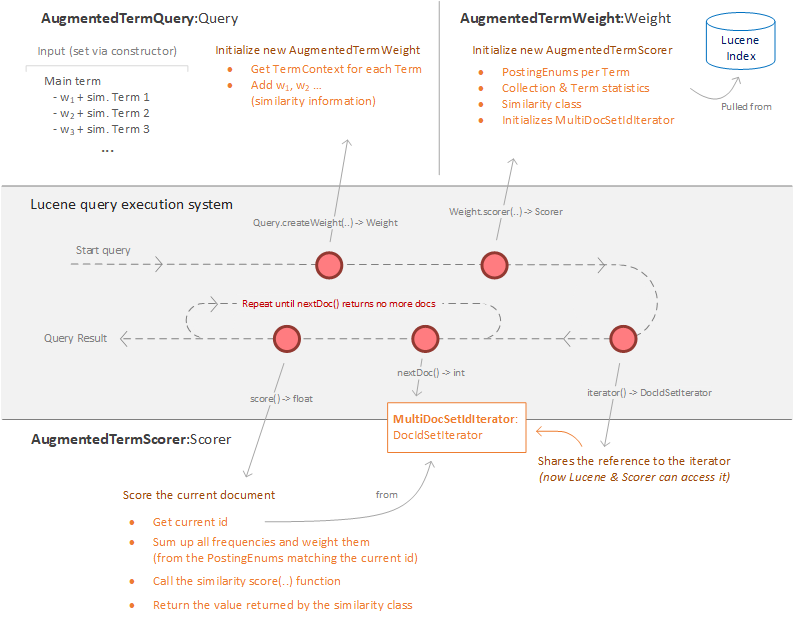

# Technical Report

This document provides an in-depth description of the implementation aspects of the project. 

## Overview

This extension project extends Lucene specific as well as Solr specific parts in the query pipeline as can be seen in Figure 1. 
It has a Solr specific query parser (``SimilarityParser``) that can be made available in the Solr configuration (``SimilarityParserPlugin``).
The parser sends the query terms (pre-processed through the specified analyzer) to the ``SimilarityApi``. *The api is not part of this repository.*

The parser than creates Lucene query objects (``AugmentedTermQuery``) that are used by the search system . Multiple queries are concatenated via a built-in ``BooleanQuery``. Each ``AugmentedTermQuery`` provides an ``AugmentedTermWeight``which in turn provides an ``AugmentedTermScorer`` that coordinates the iteration over the found documents as well as the scoring of them. The ``AugmentedTerm*`` classes are tightly coupled and cannot be used in a standalone fashion. Only the ``AugmentedTermQuery`` is used by other components. 

Every class is tested with unit or integration tests. Theses tests provide a good example of how the classes are used.

*Figure 1 - Interaction between extension classes*

## SimilarityParser

The ``SimilarityParserPlugin`` is just a factory method to create a new instance of the ``SimilarityParser``. This is specified by Solr. 

*For the usage of the ``SimilarityParserPlugin``, and all availbale configuration parameters see the [Usage Documentation](Usage.md).*

The ``SimilarityParser`` hardcodes as little as possible: It uses the defined analyzer from the Solr schema, the default search field, and the api parameters can all be set in the configuration.
The parser does not have specific command capabilities. Each term tokenized by the analyzer will be used to create an ``AugmentedTermQuery`` with information gathered from the ``SimilarityApi``. The api is only accessed once per query - with a list of all terms. The api then returns similar terms and their distances to the main term. These results are parsed in Lucene usable ``Term`` objects that are used in the ``AugmentedTermQuery``. 

## AugmentedTermQuery et al.

The structure of the ``AugmentedTerm*`` classes follows the requirements of how a Lucene search is conducted. Figure 2 shows this workflow. The interaction with the Lucene query execution system cannot be changed and the extension classes have to work around stumbling blocks to exactly match the scoring formulas defined in the paper. Specifically, the extended term frequency that is calculated by the ``AugmentedTermScorer``. The other components actively contribute information so that that the term frequency of the main term and the sum of the weighted similar term frequencies can be calculated. 

*Note: Lucene can call Weight.scorer() multiple times, for each LeafReader that is used, but it does not change the main interaction and is therefore omitted from Figure 2.*

*Figure 2 - Query workflow between Lucene & the extension classes*

### AugmentedTermQuery

The ``AugmentedTermQuery`` is used as an interface for other components and it kicks of a search. The functionality itself is limited to storing the term / similar term information as well as pulling the ``TermContext`` for each term. It is important that each unique term has its own context otherwise the ``PostingsEnum`` would be overridden in a later stage and create wrong results without throwing an error.

The term information is formed as follows (it is set in the constructor):
 - a main term
 - a list of ``<term, weight>`` tuples, i.e. the similar terms

### AugmentedTermWeight

The ``AugmentedTermWeight`` is an inline class of ``AugmentedTermQuery`` out of convenience, because it has to access the saved term information. The ``AugmentedTermQuery`` is reusable, because only the state of the ``AugmentedTermWeight`` changes during a query. 

The ``AugmentedTermWeight`` coordinates the query: it gathers the needed reference to the ``Similarity`` class, the ``CollectionStatistics``, the ``TermStatistics``, the ``PostingsEnum`` for each ``TermContext``, and it initializes the ``AugmentedTermScorer``.

#### Generalized Translation Model

The generalized translation model only changes the term frequency for all similarity measures. The statistics are only for the main term. Therefore, the weight class does not need to have a special handling for the GT. 

#### Extended Translation Model

The extended translation model extends the general model. It updates not only the term frequency per document, it also updates statistics used in the similarity computation.
The following statistics are updated:

- **Document frequency:** [Part of ``TermStatistics``] (df) Describes the number of documents that contain the main term. This is updated to df_hat to correctly reflect the number of documents that contain either the main term or at least one of the similar terms. The weights assigned to the similar terms are not used. This change requires that the ``PostingsEnum`` of all (main + similar) terms are iterated through once before the scoring, resulting in a performance penalty (there is no way around that). This is needed to count the length of the set of documents containing at least one term. Saved document frequencies cannot be used because they would potentially (and very practically) count duplicated documents more than once. *This process uses as little resources as possible: The documents are iterated with the ``MultiDocSetIdIterator`` and the iterations are counted, no actual set of documents is built-up in memory.*

- **Term collection frequency:** [Part of ``TermStatistics``] (tf_c) Describes the total occurrences of the main term in all documents (the collection). This is updated to tf_c_hat to correctly reflect the number of occurrences that incorporates the main term and all weighted similar terms. The additional occurrences from the similar terms are gathered in the document iteration of the term frequency calculation.

- **Average document length:** [Sum of all term frequencies is part of ``CollectionStatistics``] (avgdl) Describes the average terms per document. In Lucene the similarity classes compute the average, but they use the information they get from the ``CollectionStatistics``. To change the average, we only have to change the sum of all term frequencies in the statistics class and leave the total document count unchanged. A sum of (1 - weight) weighted term frequencies is computed by using the document iteration (described above, to gather the document frequency). This sum is then subtracted from the original total term frequency sum, provided by the index, to create the updated value. *Note: The total term frequency sum is probably very large and the similar term frequency (which is weighted down by 0 - 0.3, if you use the 0.7 similarity threshold) is very small in comparison. The similar terms are only for the current query. This mean the change is not drastically altering the ``CollectionStatistics``.*

- **Collection Size:** [Part of ``CollectionStatistics``] Sum of all term frequencies -> see Average Document length.

- **Document length:** The document length value of a single document, differs from the statistics above, because it is not saved in a standardized way in the index. During the indexing phase the similarity classes have the chance to calculate an arbitrary number per document. **Yes, that means changing the similarity class after indexing might require a re-indexing of all data.** The arbitrary number can be accessed via the ``LeafReaderContext`` -> ``LeafReader.getNormValues().get(id)`` during the scoring of a document by id. The similarity class, specifically the ``public final SimScorer simScorer(SimWeight stats, LeafReaderContext context)`` method defines the entry point for the context and the context can then be used inside the score method of the scorer to get the reader and the value. The context is not used by the built-in similarity classes for anything else. It is evident, that the design of Lucene does not want plugins to extend this part. But in order to update the document length we have to sneak into the context and change its behavior. To do that some creative engineering is needed: The LeafReaderContext class only has a package-private constructor, but this problem can be overcome with reflection. The ``LeafReader`` class is wrapper in ``LeafReaderOverride`` class, that has access to the original ``LeafReader`` class as well as access to the ``PostingsEnum`` iterators of the similar terms that are used to score a document (see [AugmentedTermScorer](#AugmentedTermScorer) for more). The override class now updates the document length by subtracting the sum of (1 - weight) weighted similar term frequencies for that particular document from the saved document length, because the ``PostingsEnum`` iterators are at the position of the current document when the document length is requested inside the ``Similarity.score(..)`` method. *Note: Most built-in similarity classes use a 1-byte compression for the document length. The ``LeafReaderOverride`` class can handle that scenario via a flag, and it decodes the value subtracts the similar term freq and encodes the new value again. Note 2: This change mostly does nothing, because the return value has to be rounded to a long, therefore decimal changes up to - 0.5 are not even recognized and following the average document length note, the similar term frequencies are mostly very small. Additionally, if the 1-byte compression is used, this change almost always results in the same encoded value. The TREC-8 evaluation has not a single case, where the encoded value changed.*

### AugmentedTermScorer

The ``AugmentedTermScorer`` works tightly together with the ``MultiDocSetIdIterator``. The Lucene query system has access to the iterator via a reference obtained by the ``iterator()`` method. The query system advances the iterator to the next document.

The iterator wraps all ``PostingsEnum`` iterators (main + similar), and iterates through the union of all documents in a performant linear (one-sweep) fashion. It changes the state of all wrapped ``PostingsEnum``, so that the ``AugmentedTermScorer`` can access the postings frequency information when asked to score a document. It aligns multiple ``PostingsEnum`` instances with to the same document id (if they contain the same document). The iterator only emits ascending document id values, as defined by the specification. All ``PostingsEnum`` iterators are treated equally, there is no special treatment for the main term.

To score a single document the scorer checks for each ``PostingsEnum`` if its position is at the current document id, as defined by the ``MultiDocSetIdIterator``. If so, the frequency is multiplied by the weight of the term (main term weight = 1) and added to the frequency sum. After all ``PostingsEnum`` references are checked, the score method of the ``Similarity`` class is called with the id and the frequency sum. The score value is then returned to the caller (e.g. the Lucene query execution system).

The scoring is repeated for every document exposed by the ``MultiDocSetIdIterator`` and it is stopped when the iterator returns a "no more docs" constant (Integer.MaxValue). This constant is emitted when all PostingEnums are exhausted.