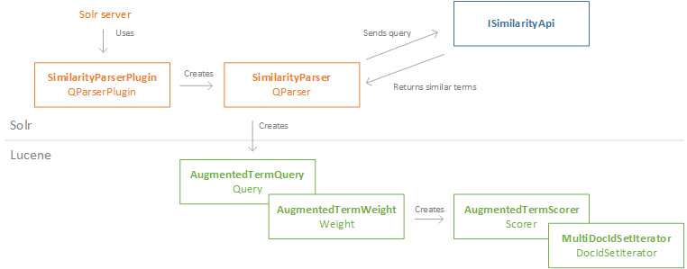

# Generalizing Translation Models
This repository contains a Lucene &amp; Solr implementation of the paper: 

  *Generalizing Translation Models in the Probabilistic Relevance Framework* 
  
  Rekabsaz, Lupu, Hanbury, Zuccon - CIKM '16 ([ACM citation](http://dl.acm.org/citation.cfm?id=2983833))

## Implementation

This repository allows to extend Lucene & Solr with a Solr Parser and a Lucene Query. Both are used to extend the search process to include similar terms through an api (the api is not part of this repository)

*Interaction between extension classes of this repository*

More information & usage instructions can be found in the [Documentation folder](Documentation)

## Dependencies

This project depends on the api: https://github.com/sebastian-hofstaetter/embedding_vector_similarity

The api must be running and accessible from the Solr server / Lucene program that uses the extensions from this repository. See the api repository for infos about the similarity computation and possible options (that can be defined in the solrconfig.xml).

## Structure

- **Extensions** contains the extension classes to be used by Lucene &amp; Solr + self-contained Unit & Integration Tests 
- **LuceneEvaluation** contains indexing & evaluation code using Lucene for the Extensions (evaluating on TREC-8)
- **Documentation** contains explanations of the code / concept and the transformation from the formulas described in the paper to Lucene useable code

The Java projects and their dependencies are managed via maven.
